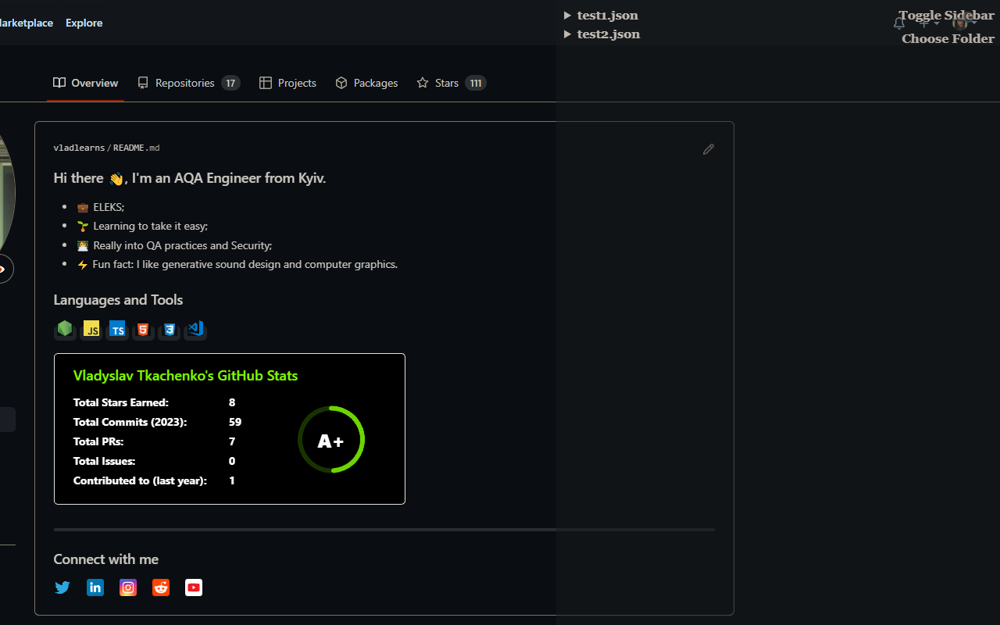
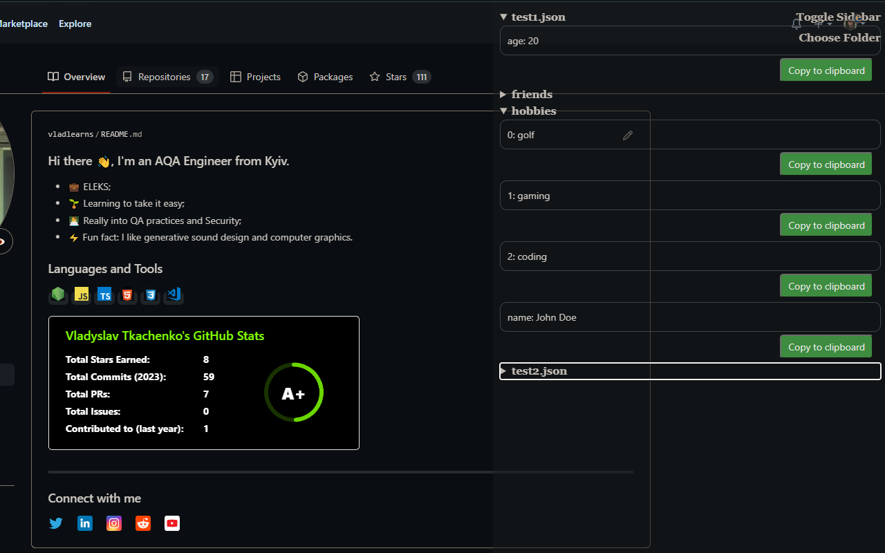

# side-copy Extension

### Showcase:

This extension is a helpful tool for anyone who works with JSON files. It adds a sidebar to your browser where you can view the contents of your JSON files in a structured and organized way, making it easier to navigate and understand large amounts of data.

With just a click of a button, you can toggle the sidebar on or off, and with another click, you can select which folder you want to open your JSON files from. The extension even has a feature that helps prevent duplicate files from appearing in the sidebar.

This extension is especially useful for developers or anyone working with JSON files. It saves time and effort by allowing you to quickly and easily view and organize your data. If you want to make your work with JSON files more efficient and organized, this extension is a must-have.

### The objective

The objective of this extension is to provide users with a useful tool that enhances their browsing experience by adding new functionalities or improving existing ones, streamlining tasks, and saving time. It aims to increase productivity, make tasks easier and more enjoyable, and improve the overall user experience while using their browser.

### How to use

To use Side-Copy, simply install the extension, choose a folder, expand spoiler and copy data.

### Installation

To install Side-Copy, simply visit the Chrome Web Store and search for "side-copy". Click on "Add to Chrome" and the extension will be added to your browser.

### Support

If you have any questions or issues with the side-copy extension, please create an issue in this repo.
